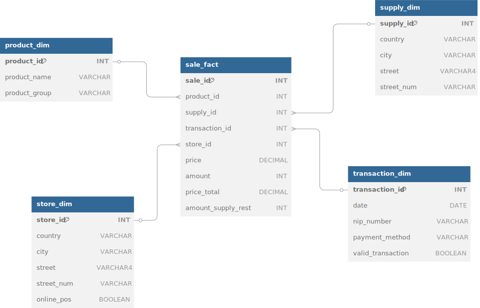

# Exercise Description
The objective of this exercise is to build a comprehensive ETL (Extract, Transform, Load) pipeline that consolidates data from multiple sources for a retail shop operating both online and physical point-of-sale (POS) systems. The pipeline will integrate data from four core data sources: online_transactions, pos_transactions, supply_inventory, and product. The main goal is to create a unified data structure that facilitates reporting and business intelligence, enabling the shop to monitor sales, inventory levels, and product performance across both sales channels.

# Schema

# Files descriptions
* source_tables.sql - tables imitating a data source
* dwh_tables.sql    - dimensions and fact tables of data warehouse
* etl.sql           - extract/transform/load from data source to dwh